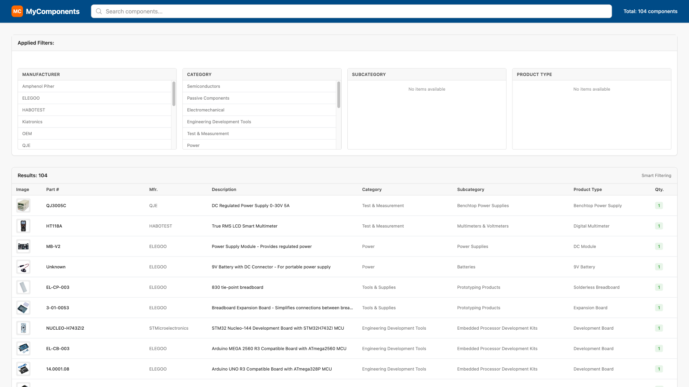

# MyComponents

A simple tool to track electronic components in my lab.



## Why This Exists

I needed to know what components I have without opening every storage box.

## Features

### Implemented ✅

- View all components in a searchable table
- Filter by manufacturer, category, subcategory, and product type
- Search by description, part number, or any field
- Mobile-responsive design for checking at the workbench
- CSV-based storage (easy to update manually)

### Planned Features

- [ ] Add/remove components through the UI
- [ ] Edit component details (quantity, description, etc)
- [ ] Export filtered results
- [ ] Low stock warnings
- [ ] Upload component images
- [ ] Barcode scanning for quick lookup

## Tech Stack

- **Remix:** Server-side rendering, works without JavaScript
- **TypeScript:** Type safety throughout
- **Tailwind CSS:** Utility-first styling
- **CSV Storage:** Simple, portable, version-controllable

## Running Locally

```bash
npm install
npm run dev
```

Visit `http://localhost:5173`

## Project Structure

```text
app/
├── components/     # Reusable UI components
├── constants/      # Centralized configuration
├── services/       # Business logic
├── utils/          # Helper functions
└── routes/         # Page handlers
```

## Design Decisions

1. **No hardcoded values** - All constants centralized
2. **Type safety** - Zero runtime type errors
3. **Single responsibility** - Each function does one thing
4. **Progressive enhancement** - Works without JavaScript

---

A practical tool for a real problem. Built to evolve with my needs.
